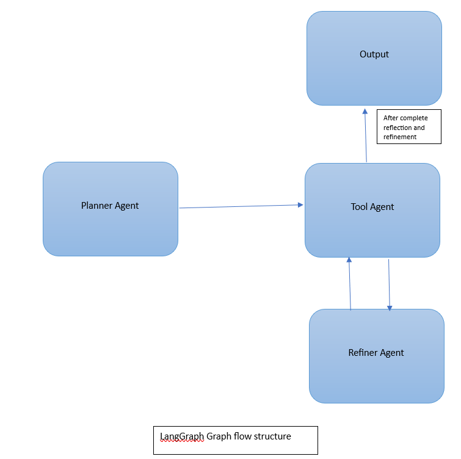

# Trip Planner Agentic AI System

This Trip Planner Agentic AI takes the idea of a trip or vacation as input (ex: *Plan a trip to Goa from Bangalore for 3 members*) and returns the output as a set of plans (tasks) and their solutions to have a good and efficient trip.

---

##  Deployment

The Agent system is deployed on an AWS EC2 instance with a POST API for user input.

---

##  How To Use

### Step 1: Using Postman

- Use Postman to POST the input and receive the output in the response (for testing the Agentic system’s performance).
- Send POST request to :  <HOST_NAME>
- Go to body , select raw format and give the input in json format
          EX:
               {
            "user_goal": "plan a trip to Goa from bangalore"
          }
- Receive output in responses in json format

### Step 2: Using Swagger UI 

-	Using Swagger UI to post input and receive the output in responses
-	Visit this url to test using Swagger UI : <HOST_NAME>
- Go to POST and give input in json format 
        EX: 
               {
          "user_goal": "plan a trip to Goa from bangalore"
        }

- Receive output in responses in json format

## Tools Used by the Agents
- WebSearch : serpapi api
- GooglePlaces: googleplaces api
- Map Distance: googlemaps api
- Currency converter: Exchange rate api

 
